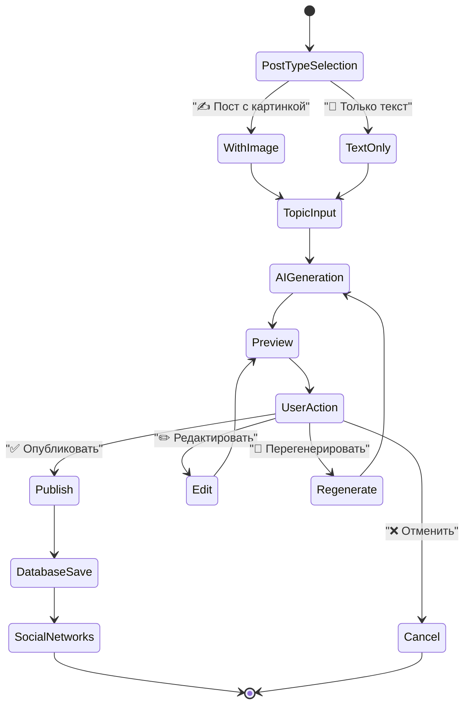
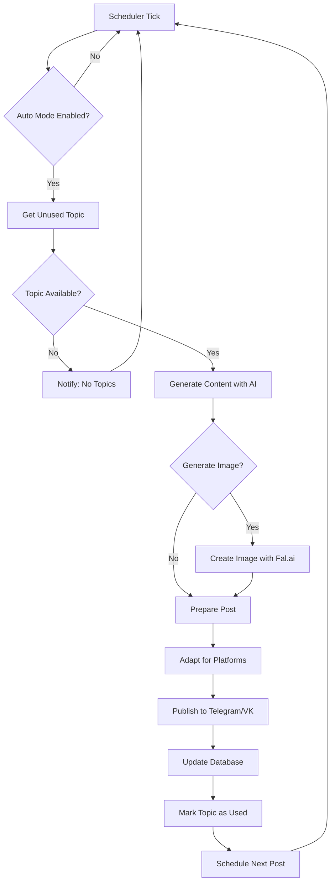
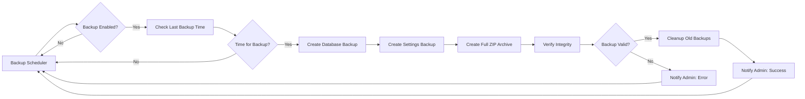

# Проект "Телеграм-бот-автопостер" v2.0

## 1. Введение

### 1.1. Цель проекта

Основная цель проекта — разработка Telegram-бота для автоматизации создания и публикации контента в Telegram-каналах и группах VK с использованием OpenRouter.ai для генерации контента.

### 1.2. Основные задачи

-   **Автоматизация**: Автоматизация процесса создания и публикации контента
-   **AI-генерация**: Создание текстового и визуального контента с помощью OpenRouter.ai и Fal.ai
-   **Кросспостинг**: Публикация в Telegram и VK
-   **Надежность**: Система резервного копирования данных
-   **Масштабируемость**: Модульная архитектура

## 2. Интерфейс и управление

### 2.1. Команды бота

Бот имеет **упрощенный интерфейс** с минимальным набором команд:

| Команда   | Описание                                          |
|-----------|---------------------------------------------------|
| `/start`  | Приветствие и переход к главному меню             |
| `/menu`   | Главное интерактивное меню со всеми функциями     |

**Весь функционал доступен через инлайн-кнопки в `/menu`**

### 2.2. Структура главного меню

```
📱 ГЛАВНОЕ МЕНЮ
├── ✍️ Создать пост
├── 🤖 Автопостинг
├── 📊 Статистика
├── 📅 Контент-план
├── 📝 Промпт текста
├── 🖼️ Промпт изображений
├── 📤 Настройки публикации
└── 💾 Резервное копирование
```

## 3. Основные возможности

### 3.1. Функциональные возможности

| Группа                        | Конкретные возможности                                                                                                                                                                 |
| ----------------------------- | -------------------------------------------------------------------------------------------------------------------------------------------------------------------------------------- |
| **Безопасность и доступ**     | Работает только с авторизованными администраторами (список `ADMIN_IDS`), middleware проверки доступа                                                                                    |
| **Интерфейс управления**      | `/menu` — главное интерактивное меню с логичной группировкой                                                                                                                           |
| **Создание контента**         | Создание постов с выбором типа (текст/изображение), предпросмотром и опциями публикации                                                                                                |
| **Автоматизация**             | Автопостинг из контент-плана с настраиваемым интервалом                                                                                                                                |
| **Управление контентом**      | Загрузка JSON файлов с темами, просмотр и редактирование контент-плана                                                                                                            |
| **Настройки публикации**      | Настройка каналов Telegram и групп VK для публикации                                                                                                                                  |
| **AI промпты**                | Управление промптами для генерации текста и изображений с предпросмотром                                                                                                              |
| **Резервное копирование**     | Автоматическое и ручное резервное копирование БД и настроек                                                                                                                           |

### 3.2. Технические возможности

- **Модульная архитектура**: Разделение на логические компоненты (handlers, services, managers)
- **Централизованная обработка ошибок**: Автоматические уведомления администраторов
- **База данных**: SQLite с connection pooling
- **Планировщики**: Автопостинг и резервное копирование
- **AI интеграции**: OpenRouter.ai для текста, Fal.ai для изображений

## 4. Технологический стек

| Слой                      | Инструменты / Библиотеки                      |
| ------------------------- | --------------------------------------------- |
| **Bot Framework**         | `aiogram 3.7+` с SQLite storage              |
| **AI Services**           | OpenRouter.ai API, Fal.ai                     |
| **База данных**           | `SQLite` с `SQLAlchemy 2.0+`                 |
| **Социальные сети**       | `vk_api`, Telegram Bot API                    |
| **Планировщики**          | `asyncio` (автопостинг, резервное копирование) |
| **Обработка ошибок**      | Централизованная система с уведомлениями     |
| **Резервное копирование** | SQLite BACKUP API, ZIP архивы                |
| **Хостинг**               | Docker-ready                                  |

## 5. Архитектура проекта

### 5.1. Модульная структура

```text
autoposter-bot/
├── bot.py                          # Точка входа, инициализация компонентов
├── bot_manager.py                  # Менеджер управления процессами бота
├── config.py                       # Конфигурация и переменные окружения
├── requirements.txt                # Зависимости Python
├── autoposting_bot.db              # База данных SQLite
│
├── docs/                           # Проектная документация
│   ├── Project.md                  # Архитектура и описание проекта
│   ├── Tasktracker.md              # Статус выполнения задач
│   ├── Diary.md                    # Журнал изменений
│   └── qa.md                       # Вопросы и ответы
│
├── handlers/                       # Модульные обработчики Telegram
│   ├── admin_handlers.py           # Middleware проверки доступа
│   ├── menu.py                     # Главное меню и навигация
│   ├── generate_post.py            # Ручная генерация постов (FSM)
│   ├── auto_mode.py                # Настройки автопостинга
│   ├── settings.py                 # Настройки публикации
│   ├── prompts.py                  # Управление AI промптами
│   ├── content_plan.py             # Управление контент-планом
│   ├── backup.py                   # Резервное копирование
│   └── stats.py                    # Статистика и мониторинг
│
├── services/                       # Внешние API и сложная логика
│   ├── ai_service.py               # OpenRouter.ai интеграция
│   ├── openrouter_service.py       # OpenRouter.ai с retry механизмом
│   ├── vk_service.py               # VK API для публикации
│   ├── image_service.py            # Обработка изображений (Fal.ai)
│   ├── scheduler.py                # Планировщик автопостинга
│   ├── backup_service.py           # Сервис резервного копирования
│   └── backup_scheduler.py         # Планировщик бэкапов
│
├── managers/                       # Бизнес-логика
│   ├── content_plan_manager.py     # Управление контент-планом
│   ├── prompt_manager.py           # Управление промптами
│   └── publishing_manager.py       # Управление публикацией
│
├── database/                       # Слой доступа к данным
│   ├── database.py                 # SQLAlchemy конфигурация
│   ├── models.py                   # Модели таблиц
│   ├── posts_db.py                 # CRUD операции с постами
│   └── settings_db.py              # CRUD операции с настройками
│
├── templates/                      # Шаблоны и промпты
│   └── style_examples.py           # Примеры стилей для AI
│
├── utils/                          # Утилиты и вспомогательные функции
│   ├── error_handler.py            # Централизованная обработка ошибок
│   └── text_utils.py               # Утилиты работы с текстом
│
└── backups/                        # Директория резервных копий
    └── [автоматические бэкапы]
```

### 5.2. Ключевые компоненты

#### 5.2.1. Handlers (Обработчики)
- **Модульная структура**: Каждый handler отвечает за свою функциональную область
- **FSM состояния**: Сложные диалоги с сохранением состояния между сессиями
- **Middleware защита**: Автоматическая проверка прав доступа
- **Обработка ошибок**: Graceful degradation с уведомлениями пользователей

#### 5.2.2. Services (Сервисы)
- **AI Service**: Интеграция с OpenRouter.ai для текста, Fal.ai для изображений с retry механизмами
- **VK Service**: Публикация постов
- **Backup Service**: Создание резервных копий с проверкой целостности
- **Schedulers**: Независимые планировщики для автопостинга и бэкапов

#### 5.2.3. Database (База данных)
- **Connection pooling**: Эффективное управление соединениями
- **Резервное копирование**: SQLite BACKUP API для надежных копий

### 5.3. Схема базы данных

```sql
-- Настройки бота (ключ-значение с описанием)
CREATE TABLE settings (
    key         TEXT PRIMARY KEY,
    value       TEXT NOT NULL,
    description TEXT,
    updated_at  TIMESTAMP DEFAULT CURRENT_TIMESTAMP
);

-- Опубликованные посты с расширенными метаданными
CREATE TABLE posts (
    id                  INTEGER PRIMARY KEY AUTOINCREMENT,
    topic               TEXT NOT NULL,
    content             TEXT NOT NULL,
    with_image          BOOLEAN DEFAULT 0,
    image_url           TEXT,
    telegram_published  BOOLEAN DEFAULT 0,
    vk_published        BOOLEAN DEFAULT 0,
    telegram_message_id TEXT,          -- ID сообщения в Telegram
    vk_post_id          TEXT,          -- ID поста в VK
    source              TEXT DEFAULT 'manual',  -- manual/auto
    published_at        TIMESTAMP DEFAULT CURRENT_TIMESTAMP,
    created_at          TIMESTAMP DEFAULT CURRENT_TIMESTAMP
);

-- Контент-план с поддержкой изображений
CREATE TABLE content_plan (
    id          INTEGER PRIMARY KEY AUTOINCREMENT,
    topic       TEXT NOT NULL UNIQUE,
    with_image  BOOLEAN DEFAULT 1,
    is_used     BOOLEAN DEFAULT 0,
    created_at  TIMESTAMP DEFAULT CURRENT_TIMESTAMP,
    used_at     TIMESTAMP
);

-- AI промпты для разных типов контента
CREATE TABLE ai_prompts (
    id          INTEGER PRIMARY KEY AUTOINCREMENT,
    prompt_type TEXT NOT NULL,  -- content_text, image_generation
    content     TEXT NOT NULL,
    is_active   BOOLEAN DEFAULT 1,
    created_at  TIMESTAMP DEFAULT CURRENT_TIMESTAMP,
    updated_at  TIMESTAMP DEFAULT CURRENT_TIMESTAMP
);

-- Настройки публикации по пользователям
CREATE TABLE publishing_settings (
    user_id       INTEGER PRIMARY KEY,
    publish_to_tg BOOLEAN DEFAULT 1,
    publish_to_vk BOOLEAN DEFAULT 0,
    tg_channel_id TEXT,
    vk_group_id   TEXT,
    updated_at    TIMESTAMP DEFAULT CURRENT_TIMESTAMP
);
```

### 5.4. Жизненный цикл создания поста



### 5.5. Архитектура автопостинга



### 5.6. Система резервного копирования



## 6. Интеграции и API

### 6.1. AI Сервисы

#### OpenRouter.ai Integration
- **Модели**: Различные модели через OpenRouter.ai API
- **Функции**: Создание постов, анализ тем
- **Обработка ошибок**: Retry с exponential backoff
- **Rate limiting**: Соблюдение лимитов API
- **Промпты**: Динамические промпты с поддержкой плейсхолдеров

#### Fal.ai Integration  
- **Модель**: Flux для генерации изображений
- **Форматы**: JPEG, PNG с оптимизацией размера
- **Fallback**: Graceful degradation при недоступности сервиса

### 6.2. Социальные сети

#### VK API
- **Публикация**: Автоматическая публикация в группы
- **Токены**: Безопасное хранение access tokens
- **Адаптация контента**: Удаление HTML тегов

#### Telegram API
- **Каналы**: Публикация в указанные каналы
- **Форматирование**: HTML разметка, изображения
- **Parse mode**: HTML для форматирования

## 7. Развертывание и эксплуатация

### 7.1. Локальная разработка
```bash
# Установка зависимостей
pip install -r requirements.txt

# Настройка переменных окружения
cp .env.example .env
# Заполнить токены и ключи API

# Запуск бота
python bot.py
```

### 7.2. Продакшн развертывание
```bash
# Управление ботом
python bot_manager.py status    # Проверка статуса
python bot_manager.py start     # Запуск бота
python bot_manager.py stop      # Остановка бота
python bot_manager.py restart   # Перезапуск
```

### 7.3. Мониторинг и обслуживание
- **Логи**: Централизованное логирование в файл `bot.log`
- **Резервные копии**: Автоматические ежедневные бэкапы
- **Уведомления**: Telegram уведомления о критических событиях

## 8. Безопасность

### 8.1. Контроль доступа
- **Администраторы**: Только пользователи из `ADMIN_IDS`
- **Middleware**: Автоматическая проверка прав на каждый запрос
- **Токены**: Безопасное хранение в переменных окружения

### 8.2. Защита данных
- **Резервное копирование**: Регулярные бэкапы с проверкой целостности
- **Шифрование**: Токены и ключи API не хранятся в коде
- **Логирование**: Исключение чувствительных данных из логов

## 9. Настройка переменных окружения

### 9.1. Основные переменные

```env
# Основные токены (обязательные)
BOT_TOKEN=            # Токен Telegram бота
ADMIN_IDS=           # ID администраторов через запятую
CHANNEL_ID=          # ID канала для публикации

# AI сервисы
OPENROUTER_API_KEY=   # Ключ OpenRouter.ai
FAL_AI_KEY=           # Ключ Fal.ai для изображений

# VK публикация (опционально)
VK_ACCESS_TOKEN=      # Токен VK API
VK_GROUP_ID=          # ID группы VK
VK_CTA_TEXT=          # Текст призыва к действию

# Прокси (опционально)
PROXY_URL=            # URL прокси-сервера
```

### 9.2. Дополнительные настройки

```env
# OpenRouter.ai настройки
OPENROUTER_POST_MODEL=      # Модель для генерации постов
OPENROUTER_MAX_RETRIES=5    # Максимальное число повторных попыток
OPENROUTER_RETRY_DELAYS=    # Задержки между попытками в секундах

# Настройки резервного копирования
BACKUP_INTERVAL_HOURS=24    # Интервал между бэкапами
MAX_BACKUPS=7              # Максимальное число хранимых копий
```

---

**Версия документа**: 2.0.3  
**Последнее обновление**: 2024-03-21  
**Статус проекта**: Стабильная версия 